Visualization
================

``` r
library(tidyverse)
```

    ## -- Attaching packages -------------- tidyverse 1.3.0 --

    ## v ggplot2 3.3.2     v purrr   0.3.4
    ## v tibble  3.0.3     v dplyr   1.0.2
    ## v tidyr   1.1.2     v stringr 1.4.0
    ## v readr   1.3.1     v forcats 0.5.0

    ## -- Conflicts ----------------- tidyverse_conflicts() --
    ## x dplyr::filter() masks stats::filter()
    ## x dplyr::lag()    masks stats::lag()

``` r
library(ggridges)
```

## Load the weather data

``` r
weather_df = 
  rnoaa::meteo_pull_monitors(
    c("USW00094728", "USC00519397", "USS0023B17S"),
    var = c("PRCP", "TMIN", "TMAX"), 
    date_min = "2017-01-01",
    date_max = "2017-12-31") %>%
  mutate(
    name = recode(
      id, 
      USW00094728 = "CentralPark_NY", 
      USC00519397 = "Waikiki_HA",
      USS0023B17S = "Waterhole_WA"),
    tmin = tmin / 10,
    tmax = tmax / 10) %>%
  select(name, id, everything())
```

    ## Registered S3 method overwritten by 'hoardr':
    ##   method           from
    ##   print.cache_info httr

    ## using cached file: C:\Users\matth\AppData\Local\Cache/R/noaa_ghcnd/USW00094728.dly

    ## date created (size, mb): 2020-10-08 14:54:57 (7.54)

    ## file min/max dates: 1869-01-01 / 2020-10-31

    ## using cached file: C:\Users\matth\AppData\Local\Cache/R/noaa_ghcnd/USC00519397.dly

    ## date created (size, mb): 2020-10-08 14:55:47 (1.703)

    ## file min/max dates: 1965-01-01 / 2020-03-31

    ## using cached file: C:\Users\matth\AppData\Local\Cache/R/noaa_ghcnd/USS0023B17S.dly

    ## date created (size, mb): 2020-10-08 14:56:24 (0.882)

    ## file min/max dates: 1999-09-01 / 2020-10-31

``` r
weather_df
```

    ## # A tibble: 1,095 x 6
    ##    name           id          date        prcp  tmax  tmin
    ##    <chr>          <chr>       <date>     <dbl> <dbl> <dbl>
    ##  1 CentralPark_NY USW00094728 2017-01-01     0   8.9   4.4
    ##  2 CentralPark_NY USW00094728 2017-01-02    53   5     2.8
    ##  3 CentralPark_NY USW00094728 2017-01-03   147   6.1   3.9
    ##  4 CentralPark_NY USW00094728 2017-01-04     0  11.1   1.1
    ##  5 CentralPark_NY USW00094728 2017-01-05     0   1.1  -2.7
    ##  6 CentralPark_NY USW00094728 2017-01-06    13   0.6  -3.8
    ##  7 CentralPark_NY USW00094728 2017-01-07    81  -3.2  -6.6
    ##  8 CentralPark_NY USW00094728 2017-01-08     0  -3.8  -8.8
    ##  9 CentralPark_NY USW00094728 2017-01-09     0  -4.9  -9.9
    ## 10 CentralPark_NY USW00094728 2017-01-10     0   7.8  -6  
    ## # ... with 1,085 more rows

## Scatterplots\!\!

Create my first scatterplot ever.

``` r
ggplot(weather_df, aes(x = tmin, y = tmax)) + 
        geom_point()
```

    ## Warning: Removed 15 rows containing missing values (geom_point).

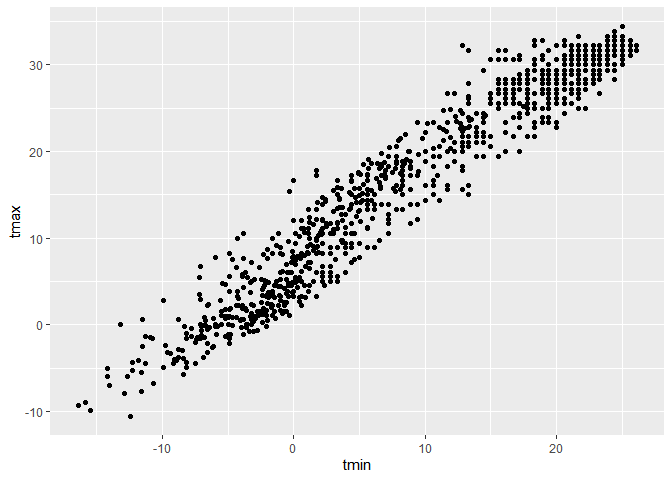<!-- -->

aes matches which variables to which part of graph geom\_point is for
scatterplots

New approach, same plot

``` r
weather_df %>% 
        ggplot(aes(x = tmin, y = tmax))+
        geom_point()
```

    ## Warning: Removed 15 rows containing missing values (geom_point).

<!-- --> This
was is a little more consistent with how we deal with data in tidy verse

save and edit a plot object.

``` r
weather_plot =
        weather_df %>% 
        ggplot(aes(x=tmin, y=tmax))

weather_plot + geom_point()
```

    ## Warning: Removed 15 rows containing missing values (geom_point).

<!-- -->

## Advanced scatterplot…

Start with the same one and make it fancy

``` r
weather_df %>% 
        ggplot(aes(x = tmin, y = tmax, color = name))+
        geom_point() + 
        geom_smooth(se = FALSE)
```

    ## `geom_smooth()` using method = 'loess' and formula 'y ~ x'

    ## Warning: Removed 15 rows containing non-finite values (stat_smooth).

    ## Warning: Removed 15 rows containing missing values (geom_point).

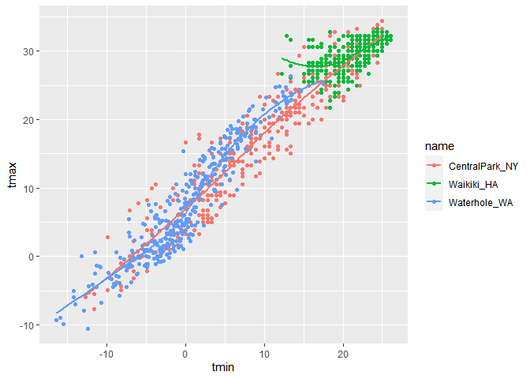<!-- -->

geom\_smooth gives a smooth trajectory through our data

What about the aes placement?

``` r
weather_df %>% 
        ggplot(aes(x = tmin, y = tmax))+
        geom_point(aes(color = name)) +
        geom_smooth()
```

    ## `geom_smooth()` using method = 'gam' and formula 'y ~ s(x, bs = "cs")'

    ## Warning: Removed 15 rows containing non-finite values (stat_smooth).

    ## Warning: Removed 15 rows containing missing values (geom_point).

<!-- --> Looks
the same, until you add geom\_smooth there are no other lines because
color only applies to geom\_point and not the gg\_plot

Let’s facet some things\!\!

``` r
weather_df %>% 
        ggplot(aes(x = tmin, y = tmax, color = name))+
        geom_point(alpha = .2) + 
        geom_smooth(se = FALSE) +
        facet_grid(. ~ name )
```

    ## `geom_smooth()` using method = 'loess' and formula 'y ~ x'

    ## Warning: Removed 15 rows containing non-finite values (stat_smooth).

    ## Warning: Removed 15 rows containing missing values (geom_point).

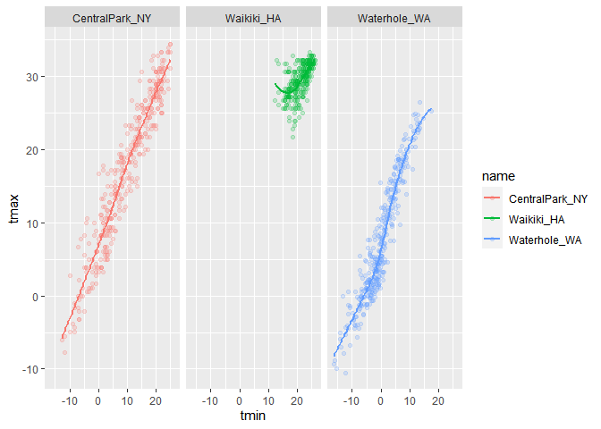<!-- -->

Facet. first item defines rows and second defines columns, separated by
tilde.

alpha in geom\_point is for transparency, can be defined by variable

Let’s combine some elements and try a new plot

``` r
weather_df %>% 
        ggplot(aes(x = date, y = tmax, color = name))+
        geom_point(aes(size = prcp),alpha = 0.5)+
        geom_smooth(se = FALSE)+
        facet_grid(. ~ name)
```

    ## `geom_smooth()` using method = 'loess' and formula 'y ~ x'

    ## Warning: Removed 3 rows containing non-finite values (stat_smooth).

    ## Warning: Removed 3 rows containing missing values (geom_point).

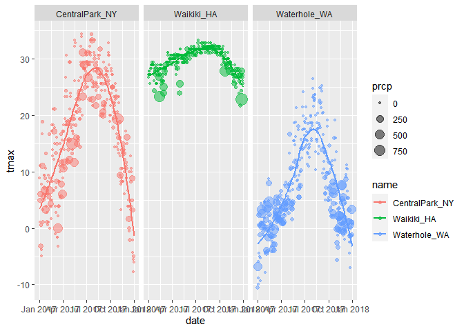<!-- -->

## Some small notes

How many geoms have to exist?

You can have whatever geoms you want

``` r
weather_df %>% 
        ggplot(aes(x = tmin, y = tmax, color = name))+
        geom_smooth(se = FALSE)
```

    ## `geom_smooth()` using method = 'loess' and formula 'y ~ x'

    ## Warning: Removed 15 rows containing non-finite values (stat_smooth).

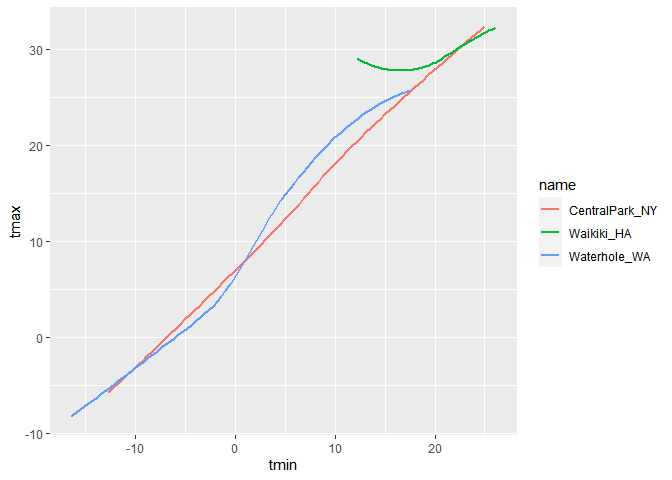<!-- -->

You can use a neat geom geom\_hex for example

``` r
weather_df %>% 
        ggplot(aes(x = tmin, y = tmax))+
        geom_density2d()+
        geom_point(alpha = 0.3)
```

    ## Warning: Removed 15 rows containing non-finite values (stat_density2d).

    ## Warning: Removed 15 rows containing missing values (geom_point).

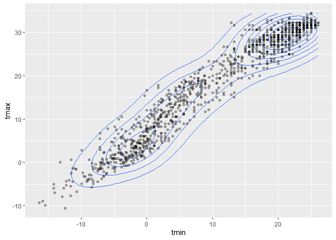<!-- -->

## Univariate plots

One variable at a time

Histograms are really great

``` r
weather_df %>% 
        ggplot(aes(x = tmin))+
        geom_histogram()
```

    ## `stat_bin()` using `bins = 30`. Pick better value with `binwidth`.

    ## Warning: Removed 15 rows containing non-finite values (stat_bin).

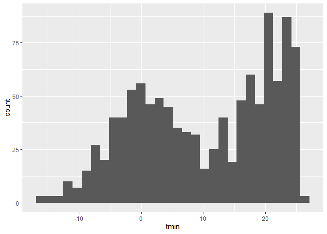<!-- -->

Can we add color to histograms?

``` r
weather_df %>% 
        ggplot(aes(x = tmin, fill = name))+
        geom_histogram()+
        facet_grid(. ~ name)
```

    ## `stat_bin()` using `bins = 30`. Pick better value with `binwidth`.

    ## Warning: Removed 15 rows containing non-finite values (stat_bin).

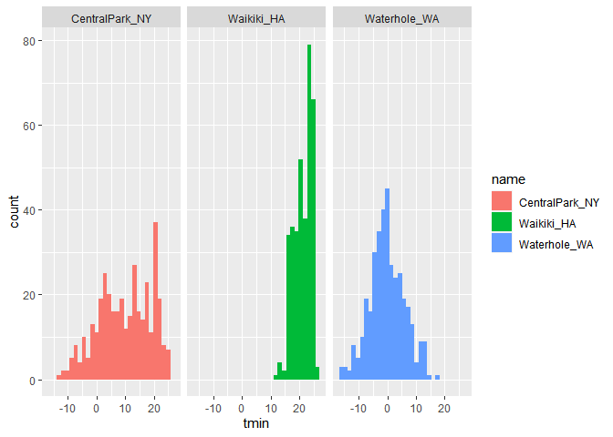<!-- -->

Use dodge to separate bars, fill fills in bars

Let’s try a new geom

``` r
weather_df %>% 
        ggplot(aes(x = tmin, fill = name))+
        geom_density(alpha = 0.4, adjust = .5)
```

    ## Warning: Removed 15 rows containing non-finite values (stat_density).

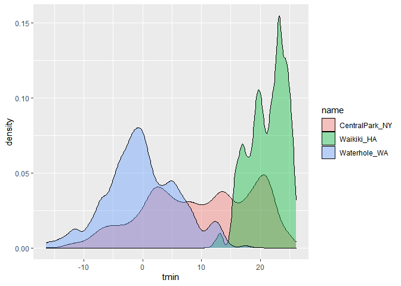<!-- -->

Density is a histogram that’s been smoothed out around the edges

What about box plots

``` r
weather_df %>% 
        ggplot(aes(x = name, y = tmin))+
        geom_boxplot()
```

    ## Warning: Removed 15 rows containing non-finite values (stat_boxplot).

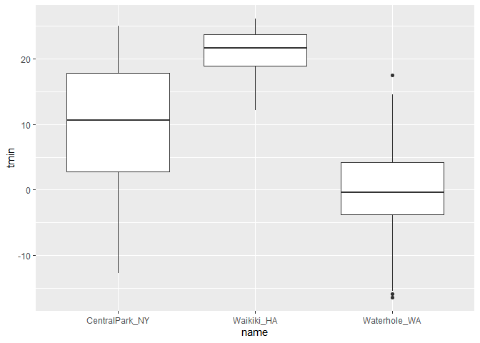<!-- -->

Trendy plots\!

``` r
weather_df %>% 
        ggplot(aes(x = name, y = tmin, fill = name)) +
        geom_violin(alpha = .5) +
        stat_summary(fun = "median")
```

    ## Warning: Removed 15 rows containing non-finite values (stat_ydensity).

    ## Warning: Removed 15 rows containing non-finite values (stat_summary).

    ## Warning: Removed 3 rows containing missing values (geom_segment).

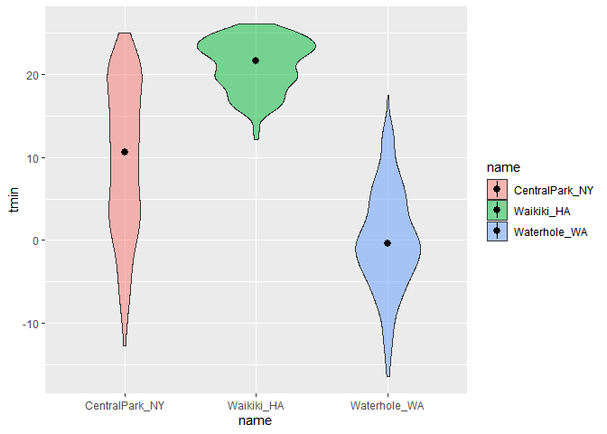<!-- -->

default for stat\_summary is the mean

Ride plots – the most popular plot of 2017

``` r
weather_df %>% 
        ggplot(aes(x = tmin, y = name))+
        geom_density_ridges()
```

    ## Picking joint bandwidth of 1.67

    ## Warning: Removed 15 rows containing non-finite values (stat_density_ridges).

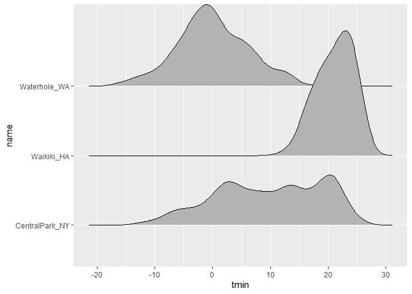<!-- -->

## Save and Embed

Let’s save a scatterplot

``` r
weather_plot =
weather_df %>% 
       ggplot(aes(x = tmin, y = tmax, color = name))+
        geom_point(alpha = .5)

weather_plot
```

    ## Warning: Removed 15 rows containing missing values (geom_point).

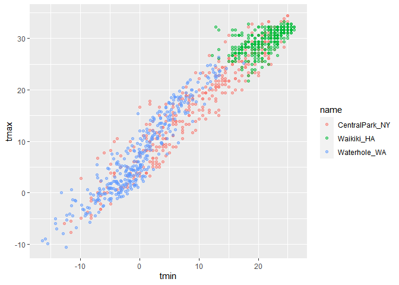<!-- -->

``` r
ggsave("./results/weather_plot.pdf", weather_plot, width = 8, height = 5)
```

    ## Warning: Removed 15 rows containing missing values (geom_point).

What about embedding…

``` r
weather_plot
```

    ## Warning: Removed 15 rows containing missing values (geom_point).

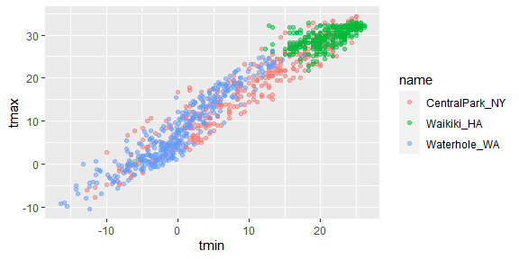<!-- -->

``` r
weather_plot
```

    ## Warning: Removed 15 rows containing missing values (geom_point).

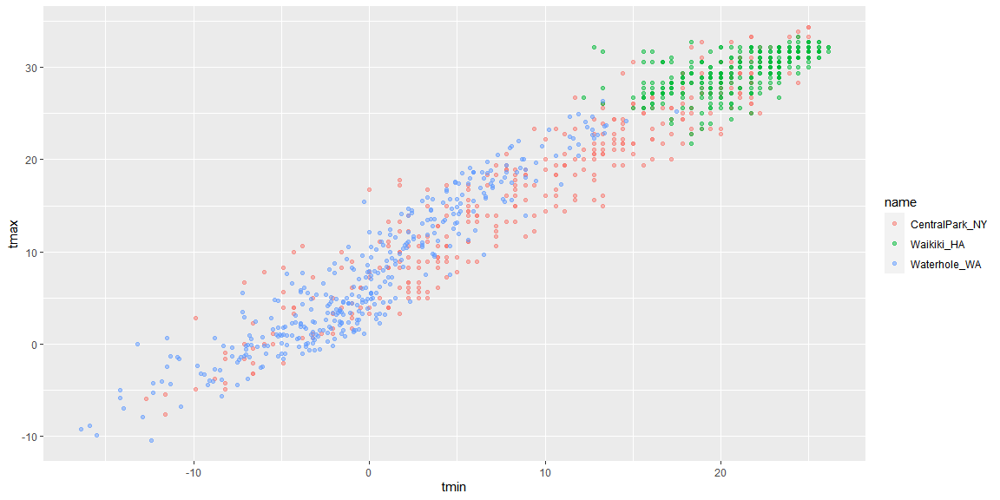<!-- -->
